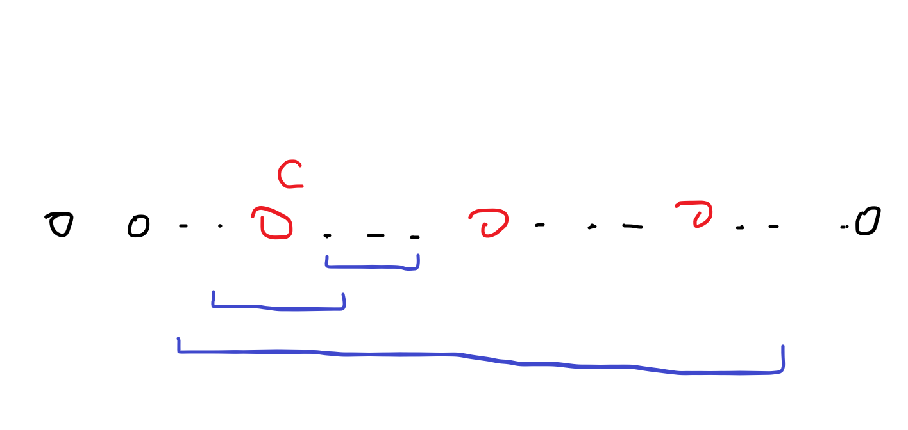

---
authors:
  - lnw143
categories:
  - Codeforces
date: 2024-07-07
---

# CF1267H Help BerLine

## 题意

已知有 $n \le 8500$ 个基地，以及开启它们的顺序排列 $p$，初始所有基地都关闭。

求一个整数序列 $f$ 使得在任意时刻，已开启的基地的 $f$ 值按顺序排成的序列满足：

- 任意子段都有一个只出现在其中过一次的值（以下记为**合法**）

- $\forall i, f_i \in [1,24]$

## 思考

发现 $\lceil \log _{\frac 3 2} 8500 \rceil = 23$，于是考虑缩小问题规模递归求解。

考虑用一种颜色 $c$ 尽可能多且合法地填。

首先合法的必要条件显然是任意时刻序列中相邻的值都不同。

发现如果填 $c$ 的位置在任意时刻都不相邻，且剩下的位置提取出来后任意时刻合法，那么必有当前序列任意时刻合法。

**形式化地**，设 $S \subseteq \{1,2,\dots,n\}$ 为填 $c$ 的位置集合，即 $\forall i \in [1,n], f_i = c \iff i \in S$。

那么如果任意时刻均有 $\forall i,j \in S \land i \not = j, i,j$ 不相邻，便可递归解决剩下的位置集合 $\{1,2,\dots,n\} \setminus S$。

感性理解：对于任意时刻，显然任意值为 $c$ 的位置不相邻，那么便如下图：



显然任意子段都属于上面三种之一，且都合法。

## 解法

于是我们便可以尽可能地在满足任意时刻填 $c$ 的位置都不相邻的前提下，填尽可能多的 $c$。

于是问题就简单了，任意时刻填 $c$ 的位置都不相邻可以转化为当它刚好被加入序列的时刻它的前驱后继都不为 $c$，于是从后往前扫一遍就可以了。

且显然有一个点填 $c$ 最多使得两个点无法填 $c$，于是可以把问题规模减小 $\lceil \frac n 3 \rceil$，可以通过本题。

```cpp
void _main() {
	int n;
	scanf("%d",&n);
	vec<int> p(n),s(n);
	for(auto &i : p) scanf("%d",&i),--i;
	reverse(p.begin(),p.end());
	for(int i=1; !p.empty(); ++i) {
		set<int> st;
		vec<bool> v(n,0);
		for(auto u : p) st.insert(u);
		for(auto u : p) {
			if(!v[u]) {
				v[u]=true;
				s[u]=i;
				auto it=st.find(u);
				if(it!=st.begin()) {
					auto j=it;
					--j;
					v[*j]=true;
				}
				{
					auto j=it;
					++j;
					if(j!=st.end()) v[*j]=true;
				}
			}
			st.erase(u);
		}
		vec<int> q;
		for(auto u : p) if(!s[u]) q.push_back(u);
		p=q;
	}
	for(auto i : s) printf("%d ",i);
	putchar('\n');
}
```

## 补充

这个做法十分的不直观，因为考虑 $p = \{1,2,3,4\}$，若 $f = \{1,2,1,2\}$，虽然符合任意时刻相邻两个都不相同，但却是非法的。

这是因为当我们把 $\{1,3\}$ 两个位置的 $f$ 标为 $1$ 时，缩小了问题规模，删除了他们，这时 $p = \{2,4\}$，因此 $2$ 与 $4$ 相邻，我们就不能使 $f = \{2,2\}$，而是 $f = \{3,2\}$，合并得到 $f = \{1,3,1,2\}$。