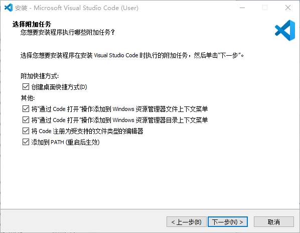

---
authors:
  - lnw143
categories:
  - Misc
date:
  created: 2024-08-06
  updated: 2024-08-06
---

# VSCode 配置

## 前言

作为 [VSCode](https://code.visualstudio.com/) 资深用户，从第一次下载到如今，踩了一个又一个坑，在这里记录一下我的配置方法以及遇到的一些问题。

## 准备

在官网下载后，点开安装程序，建议勾选以下所有选项：



等待安装完毕即可。

## 插件

插件是 VSCode 的核心，其强大的插件开发社区是一大亮点。

打开左侧的扩展管理器，搜索并点击安装便可将插件添加到 VSCode。

如搜索 `chinese`，安装中文语言包。

可以在终端用 `code --install-extension <extension-id>` 或按 `F1 / Ctrl+Shift+P` 打开命令面板，搜索 `ext install` 并选择 `Extensions: Install Extension`，输入插件名称或 ID 安装插件。

[附录](#常用插件) 有一些常用的插件。

## 配置

VSCode 默认是不支持编译运行 `C++` 的，需要安装插件 [`C/C++`](https://marketplace.visualstudio.com/items?itemName=ms-vscode.cpptools-extension-pack) 并配置文件。

`Ctrl+K Ctrl+O` 打开一个工作文件夹，并新建 `.vscode` 文件夹，并新建两个文件 `tasks.json` 和 `launch.json`。

### Tasks

`tasks.json` 文件用来配置编译任务，可以配置多个编译任务，每个任务对应一个编译命令。

尝试在 `tasks.json` 文件中添加以下内容：

```json
{
	"tasks": [
		{
			"type": "cppbuild",
			"label": "C++14",
			"command": "g++",
			"args": [
				"${file}",
				"-o",
				"${fileDirname}\\a.exe",
				"-std=c++14",
				"-Wall",
				"-Wextra",
				"-g",
				"-Wl,--stack=128000000",
				"-fno-ms-extensions"
			],
			"options": {
				"cwd": "${fileDirname}"
			},
			"problemMatcher": [
				"$gcc"
			],
			"group": {
				"kind": "build",
				"isDefault": true
			}
		},
		{
			"type": "cppbuild",
			"label": "C++14 With O2",
			"command": "g++",
			"args": [
				"${file}",
				"-o",
				"${fileDirname}\\a.exe",
				"-std=c++14",
				"-O2",
				"-Wall",
				"-Wextra",
				"-g",
				"-Wl,--stack=128000000",
				"-fno-ms-extensions"
			],
			"options": {
				"cwd": "${fileDirname}"
			},
			"problemMatcher": [
				"$gcc"
			],
			"group": {
				"kind": "build",
				"isDefault": false
			}
		},
	],
	"version": "2.0.0"
}
```

其中 `label` 字段是任务的名称，`command` 字段是编译器，`args` 字段是编译命令，`cwd` 字段是编译命令的运行目录，`isDefault` 字段是是否为默认编译任务。

之所以输出为 `a.exe`，是为了兼容源代码文件名中的中文字符，如果不需要，可以改为 `${fileBasenameNoExtension}.exe`。

???+ warning
	非必要不要更改 `cwd`，`type`，`problemMatcher`等字段，否则可能导致任务执行失败。

### Launch

`launch.json` 文件用来配置调试任务，可以配置多个调试任务，每个任务对应一个调试命令。

尝试在 `launch.json` 文件中添加以下内容：

```json
{
	"version": "0.2.0",
	"configurations": [
		{
			"name": "Launch Program",
			"type": "cppdbg",
			"request": "launch",
			"program": "${fileDirname}\\a.exe",
			"args": [],
			"stopAtEntry": false,
			"cwd": "${fileDirname}",
			"environment": [],
			"externalConsole": false,
			"MIMode": "gdb",
			"setupCommands": [
				{
					"description": "Enable pretty-printing for gdb",
					"text": "-enable-pretty-printing",
					"ignoreFailures": true
				}
			],
			"preLaunchTask": "C++14"
		}
	]
}
```

其中一般只需要配置 `preLaunchTask` 与 `program` 字段，前者指定编译任务，后者指定运行程序。

### 全局配置

你是否有这样的烦恼：每次新建 VSCode 工作文件夹都要配置 `tasks.json` 和 `launch.json`？每次编译都会自动生成 `.vscode` 文件夹？

VSCode 的全局 `tasks.json` 配置位于 `%APPDATA%\Code\User\tasks.json`，可以编辑该文件来配置全局编译任务。

而 `launch.json` 配置位于 `%APPDATA%\Code\User\settings.json`，在其中加入以下内容：

```json
"launch": < launch.json 配置内容 >
```

这样即可实现一次配置，终身受益（

## 附录

### 常用插件

#### Tools

- [CPH](https://marketplace.visualstudio.com/items?itemName=DivyanshuAgrawal.competitive-programming-helper)

- [cpp-code-template](https://marketplace.visualstudio.com/items?itemName=dreamy-xay.dreamy-cpp)

- [filesize](https://marketplace.visualstudio.com/items?itemName=mkxml.vscode-filesize)

- [FittenCode](https://marketplace.visualstudio.com/items?itemName=FittenTech.Fitten-Code)

#### Themes

- [One Dark Pro](https://marketplace.visualstudio.com/items?itemName=zhuangtongfa.Material-theme)

- [Night Owl](https://marketplace.visualstudio.com/items?itemName=sdras.night-owl)

- [Monokai Pro](https://marketplace.visualstudio.com/items?itemName=monokai.theme-monokai-pro-vscode)

- [GitHub Theme](https://marketplace.visualstudio.com/items?itemName=GitHub.github-vscode-theme)

- [2077 theme](https://marketplace.visualstudio.com/items?itemName=Endormi.2077-theme)

- [Eva Theme](https://marketplace.visualstudio.com/items?itemName=fisheva.eva-theme)

- [hacker-theme](https://marketplace.visualstudio.com/items?itemName=thorerik.hacker-theme)

- [JellyFish Theme](https://marketplace.visualstudio.com/items?itemName=PawelBorkar.jellyfish)

- [Learn with Sumit Theme](https://marketplace.visualstudio.com/items?itemName=SumitSaha.learn-with-sumit-theme)

- [MacOS Modern Theme](https://marketplace.visualstudio.com/items?itemName=davidbwaters.macos-modern-theme)

- [Office Theme](https://marketplace.visualstudio.com/items?itemName=huacat.office-theme)

- [Origamid Theme](https://marketplace.visualstudio.com/items?itemName=origamid.origamid-theme)

- [Palenight Theme](https://marketplace.visualstudio.com/items?itemName=whizkydee.material-palenight-theme)

- [Winter is Coming Theme](https://marketplace.visualstudio.com/items?itemName=johnpapa.winteriscoming)