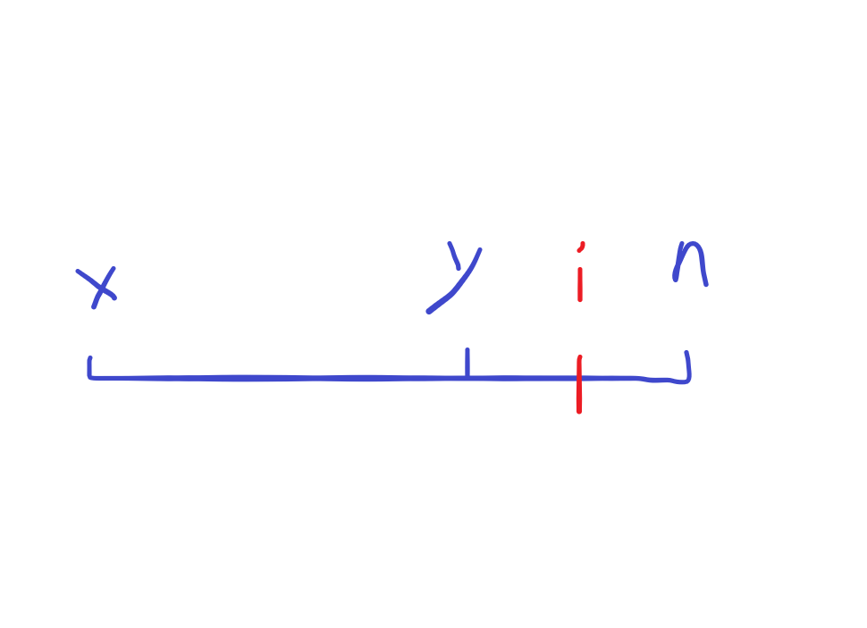
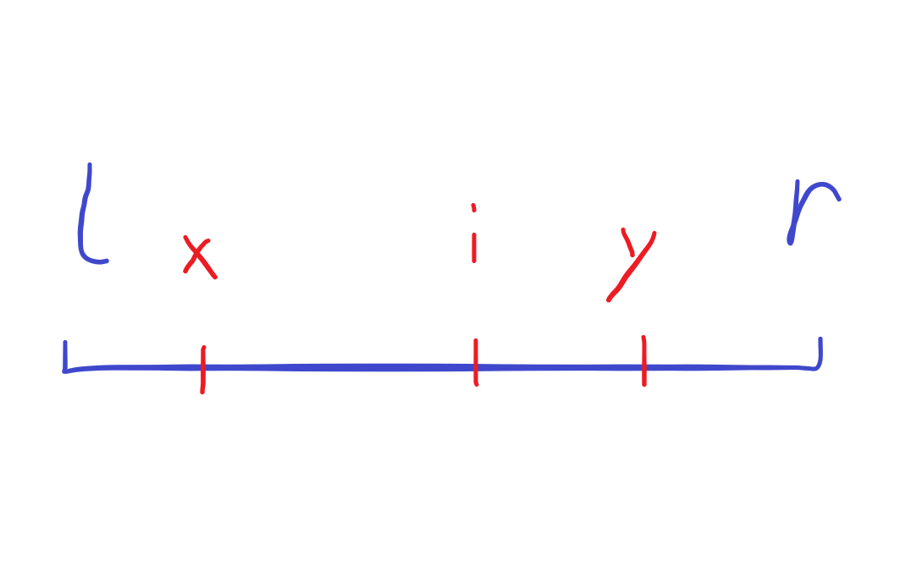
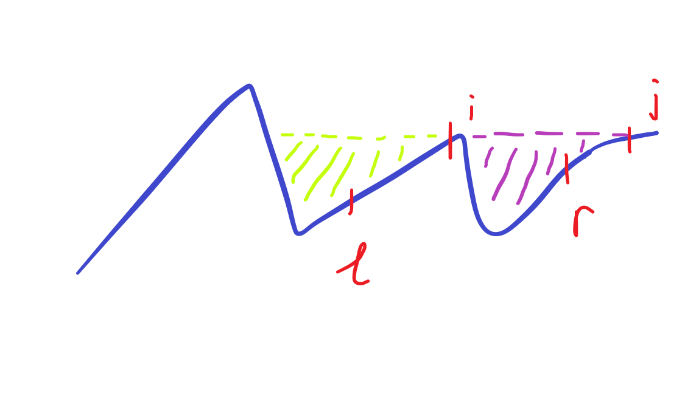

---
authors:
  - lnw143
date:
  created: 2024-08-06
  updated: 2024-08-06
categories:
  - GMOJ
---

# 8113. 【2022.10.7联考noip模拟】Talulah

## 题意

给定长度为 $n$ 的排列 $p$，定义集合 $S_i = \{j \mid j \ge i \land \max_{k \in [i,j]} p_k = p_j\}$。

给定 $q$ 次询问 $l,r$，求 $\sum_{x,y \in [l,r]} |S_x \cap S_y|$。

$n,q \le 2.5 \times 10^5$

## 思考

考虑钦定 $x<y$，如下图所示：

发现 $\forall i \ge y$，$i \in S_x \Rightarrow i \in S_y$。

*Proof:* 因为 $i \in S_x$，所以 $\max_{k \in [x,i]} p_k = p_i$，因此显然 $\max_{k \in [y,i]} p_k = p_i$，即 $i \in S_y$。$\square$

因此 $|S_x \cap S_y| = |S_x \cap [x,y)| + |S_y|$。

考虑把这两个部分分开处理，发现所有 $|S_y|$ 即为 $\sum_{i \in [l,r]} (i-l)|S_i|$，可以用前缀和 $\mathrm O(1)$ 计算。

考虑计算 $\sum_{l \le x \lt y \le r} |S_x \cap [x,y)|$，如下图所示：

正难则反，考虑抛弃 $y$ 的限制，而是计算 $i \in S_x$ 的贡献。

发现 $\forall i \in S_x \cap [x,r]$，对于 $\forall y \gt i$ 都有 $1$ 的贡献，即原式等于 $\sum_{i \in S_x \cap [x,r]} r-i$。

发现这个不好维护，于是正难则反，考虑计算 $\forall i \in [l,r]$ 对 $x \le i$ 的贡献。

记 $\mathrm{pre}_i = \max_{j \lt i} {j \mid p_j \gt p_i}$，即 $i$ 前第一个大于 $i$ 的元素的位置，并记 $p_0 = \infty$。

发现 $\forall i \in [l,r]$，$i$ 对 $x \in (\mathrm{pre}_i,i]$ 有 $r-i$ 的贡献。

由于我们不清楚 $r$ 的值，因此我们维护 $r$ 的系数即可。

如上图，考虑用线段树维护区间加与区间和。

考虑 $i \in [l,r]$ 这条限制，容易发现当 $i \lt l$ 时，$i$ 对 $[l,r]$ 无贡献；当 $i \gt r$ 时，如上图的 $j$，会对 $[l,r]$ 产生多余的贡献。

因此我们把询问离线并按右端点排序，依次加点即可。

最后别忘了我们计算的是 $x \lt y$ 的答案，剩下部分是 naive 的。

如果强制在线的话，可以用可持久化线段树 + 标记永久化解决，时间复杂度同为 $\mathrm O((n+q) \log n)$。

